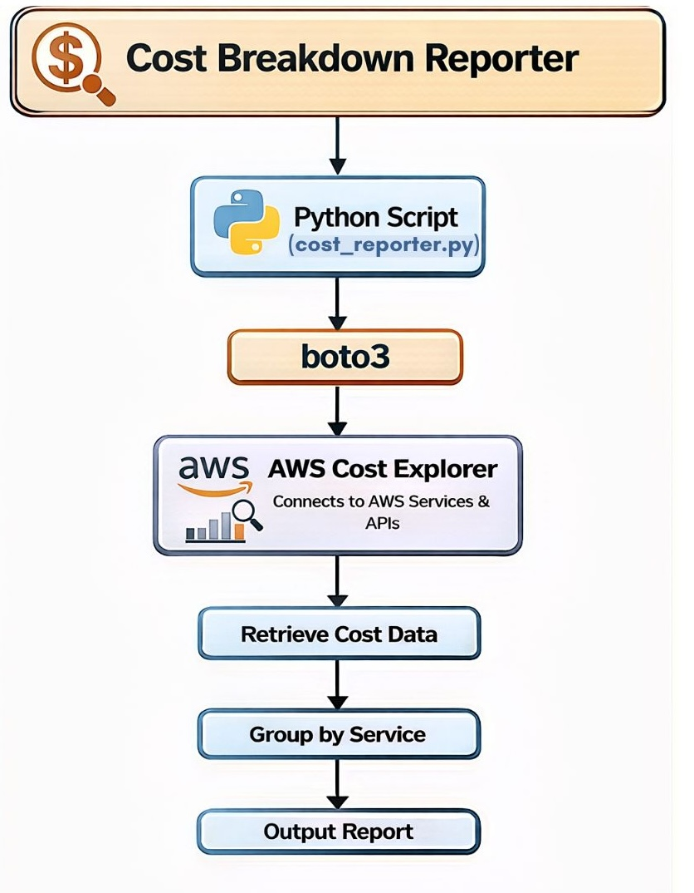

# Python Automation Script: AWS Services Cost Reporter

This Script retrieves cost data and groups by AWS services.

### Use Cases:
This script is useful for 
 - Understanding spending trends
 - Identifying expensive services
 - Enabling cost accountability

### Usage:

python3 cost_reporter.py

### Architecture Diagram

